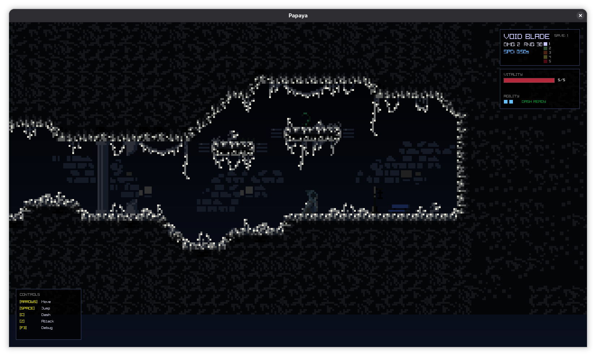
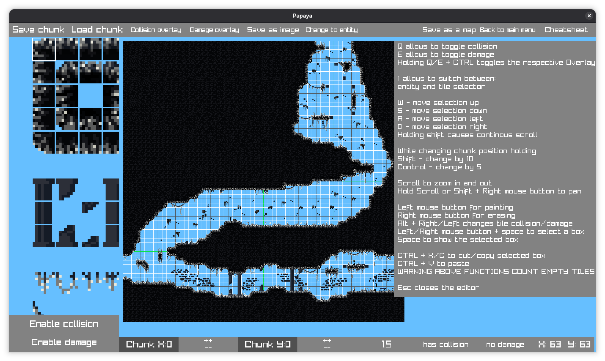

# papaya
This is platform game made for Collage subject. 
It features:
 - Bosses
 - Advanced bosses
 - Map Editor


# How to get the game
## Download precompiled binary(Easy)
Downloand `.zip` for your system and launch it.
## Build
### Requirements
 - `raylib>=5.5`
 - `cmake>=3.16`
 -  `C++` 20
### Getting source files
Clone this repo with git
```
git clone https://github.com/EleuteriaHortensjaHiacynta/papaya
```
### Building
Create and enter your build catalog in this example `build/`
```
mkdir build
cd build
```
Initiaze build folder with `cmake`
```
cmake ..
```
Build game 
```
cmake --build . --parallel
```
Now compiled game is in `bin/` you can launch is with:
```
cd bin
./papaya
```
